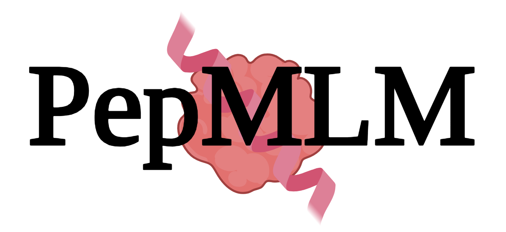
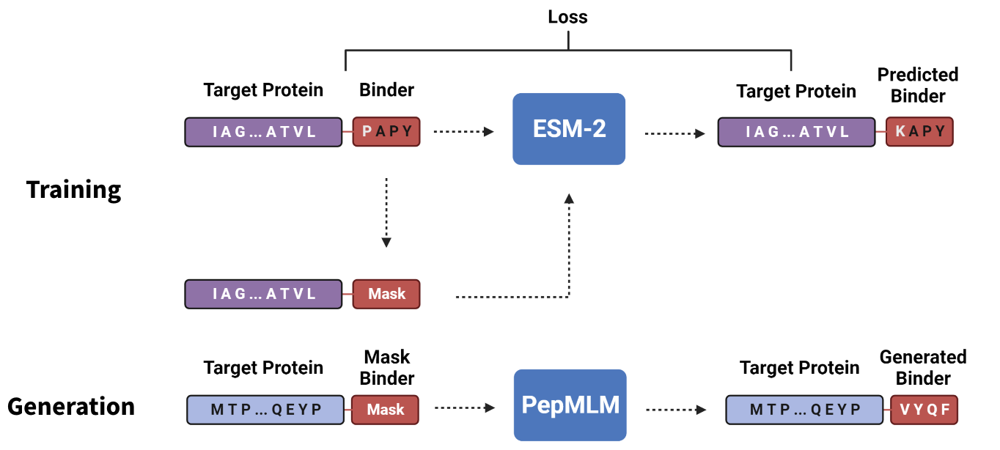

# : Target Sequence-Conditioned Generation of Peptide Binders via Masked Language Modeling 
In this work, we introduce **PepMLM**, a purely target sequence-conditioned de novo generator of linear peptide binders. By employing a novel masking strategy that uniquely positions cognate peptide sequences at the terminus of target protein sequences, PepMLM tasks the state-of-the-art ESM-2 pLM to fully reconstruct the binder region, achieving low perplexities matching or improving upon previously-validated peptide-protein sequence pairs. After successful *in silico* benchmarking with AlphaFold-Multimer, we experimentally verify PepMLM's efficacy via fusion of model-derived peptides to E3 ubiquitin ligase domains, demonstrating endogenous degradation of target substrates in cellular models. In total, PepMLM enables the generative design of candidate binders to any target protein, without the requirement of target structure, empowering downstream programmable proteome editing applications.



Check out our [manuscript](https://arxiv.org/abs/2310.03842) on the *arXiv*!

- HuggingFace: [Link](https://huggingface.co/TianlaiChen/PepMLM-650M)
- Demo: HuggingFace Space Demo [Link](https://huggingface.co/spaces/TianlaiChen/PepMLM).
- Colab Notebook: [Link](https://colab.research.google.com/drive/1u0i-LBog_lvQ5YRKs7QLKh_RtI-tV8qM?usp=sharing)

# Apply for Access
As of February 2024, the model has been gated on HuggingFace. If you wish to use our model, please visit our page on the HuggingFace site ([Link](https://huggingface.co/ChatterjeeLab/PepMLM-650M)) and submit your access request there. An active HuggingFace account is necessary for both the application and subsequent modeling use. Approval of requests may take a few days, as we are a small lab with a manual approval process.

Once your request is approved, you will need your personal access token to begin using this notebook. We appreciate your understanding.

- How to find your access token: https://huggingface.co/docs/hub/en/security-tokens

# Load Model
```
# Load model directly
from transformers import AutoTokenizer, AutoModelForMaskedLM

tokenizer = AutoTokenizer.from_pretrained("TianlaiChen/PepMLM-650M")
model = AutoModelForMaskedLM.from_pretrained("TianlaiChen/PepMLM-650M")
```
Shield: [![CC BY-NC-SA 4.0][cc-by-nc-sa-shield]][cc-by-nc-sa]

# License
This work is licensed under a
[Creative Commons Attribution-NonCommercial-ShareAlike 4.0 International License][cc-by-nc-sa].

[![CC BY-NC-SA 4.0][cc-by-nc-sa-image]][cc-by-nc-sa]

[cc-by-nc-sa]: http://creativecommons.org/licenses/by-nc-sa/4.0/
[cc-by-nc-sa-image]: https://licensebuttons.net/l/by-nc-sa/4.0/88x31.png
[cc-by-nc-sa-shield]: https://img.shields.io/badge/License-CC%20BY--NC--SA%204.0-lightgrey.svg
Contact: pranam.chatterjee@duke.edu

# Citation
```
@article{chen2023pepmlm,
  title={PepMLM: Target Sequence-Conditioned Generation of Peptide Binders via Masked Language Modeling},
  author={Chen, Tianlai and Pertsemlidis, Sarah and Kavirayuni, Venkata Srikar and Vure, Pranay and Pulugurta, Rishab and Hsu, Ashley and Vincoff, Sophia and Yudistyra, Vivian and Hong, Lauren and Wang, Tian and others},
  journal={ArXiv},
  year={2023},
  publisher={arXiv}
}
```
