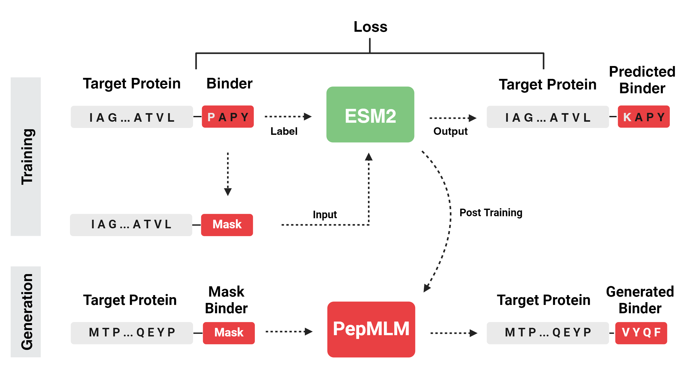

# PepMLM: Target Sequence-Conditioned Generation of Peptide Binders via Masked Language Modeling
In this work, we introduce **PepMLM**, a purely target sequence-conditioned de novo generator of linear peptide binders. By employing a novel masking strategy that uniquely positions cognate peptide sequences at the terminus of target protein sequences, PepMLM tasks the state-of-the-art ESM-2 pLM to fully reconstruct the binder region, achieving low perplexities matching or improving upon previously-validated peptide-protein sequence pairs. After successful *in silico* benchmarking with AlphaFold-Multimer, we experimentally verify PepMLM's efficacy via fusion of model-derived peptides to E3 ubiquitin ligase domains, demonstrating endogenous degradation of target substrates in cellular models. In total, PepMLM enables the generative design of candidate binders to any target protein, without the requirement of target structure, empowering downstream programmable proteome editing applications.



Check out our [manuscript](https://arxiv.org/abs/2310.03842) on the *arXiv*!

- HuggingFace: [Link](https://huggingface.co/TianlaiChen/PepMLM-650M)
- Demo: HuggingFace Space Demo [Link](https://huggingface.co/spaces/TianlaiChen/PepMLM).
- Colab Notebook: [Link](https://colab.research.google.com/drive/1u0i-LBog_lvQ5YRKs7QLKh_RtI-tV8qM?usp=sharing)

```
# Load model directly
from transformers import AutoTokenizer, AutoModelForMaskedLM

tokenizer = AutoTokenizer.from_pretrained("TianlaiChen/PepMLM-650M")
model = AutoModelForMaskedLM.from_pretrained("TianlaiChen/PepMLM-650M")
```
